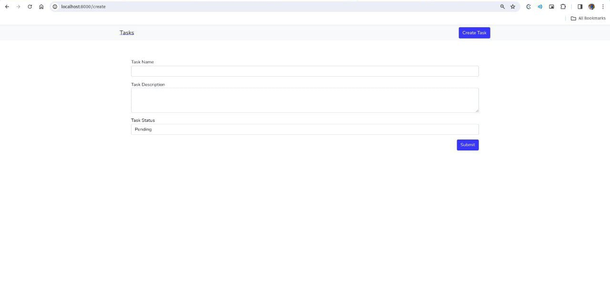

# Task Management Web Application

This web application is built using Laravel and provides a simple interface for managing tasks. Users can perform CRUD operations (Create, Read, Update, Delete) on tasks, and the application features a responsive and visually appealing design.

## Table of Contents

-   [Features](#features)
-   [Prerequisites](#prerequisites)
-   [Installation](#installation)
-   [Usage](#usage)
-   [Screenshots] (#screenshots)

## Features

-   User-friendly interface for task management
-   Responsive design using HTML, CSS, and JavaScript
-   Client-side validation for task titles (mandatory, character limit)
-   CRUD operations for tasks (Add, View, Edit, Delete)
-   Sorting and filtering functionality for tasks
-   RESTful API endpoints for task management
-   Implementation of Laravel routes and controllers
-   Use of Laravel's Eloquent ORM for database interactions

## Prerequisites

Before you begin, ensure you have met the following requirements:

-   [Composer](https://getcomposer.org/) installed
-   A web server such as Apache, Nginx or XAMPP
-   PHP version 7.4 or higher with PDO extension enabled

## Installation

Clone the repository:

    git clone https://github.com/FDREAMER2003/Laravel-Task-App.git

To install the required packages and initialize the Laravel application, follow these steps:

1. Change to the directory of the cloned repository:

    cd Laravel-Task-App/

2. Install the required packages using Composer:

    composer install

3. Copy the Environment File:

    cp .env.example .env

4. Generate Application Key:

    php artisan key:generate

5. Configure Database:

    Update the .env file with your database credentials (DB_DATABASE, DB_USERNAME, DB_PASSWORD).

6. Run Migrations:

    php artisan migrate

7. Start the Development Server:

    php artisan serve

Your application will be available at http://localhost:8000.
Open a Browser and visit http://localhost:8000 to start using the application.

## Usage

1. Access the application in your web browser.
2. Create tasks by filling out the necessary details and clicking the 'Submit' button.
3. Edit task details by selecting the 'Edit' option.
4. Mark tasks as completed or pending using the provided options.
5. Delete tasks you no longer need.
6. Use the sorting and filtering options to organize your tasks based on your preferences.

## Screenshots

Screenshot of the index page showing a list of all tasks

Screenshot of the index page showing a list of filtered tasks that have been completed.

Screenshot of the Task Creation page.

Screenshot of the Task Creation page.

